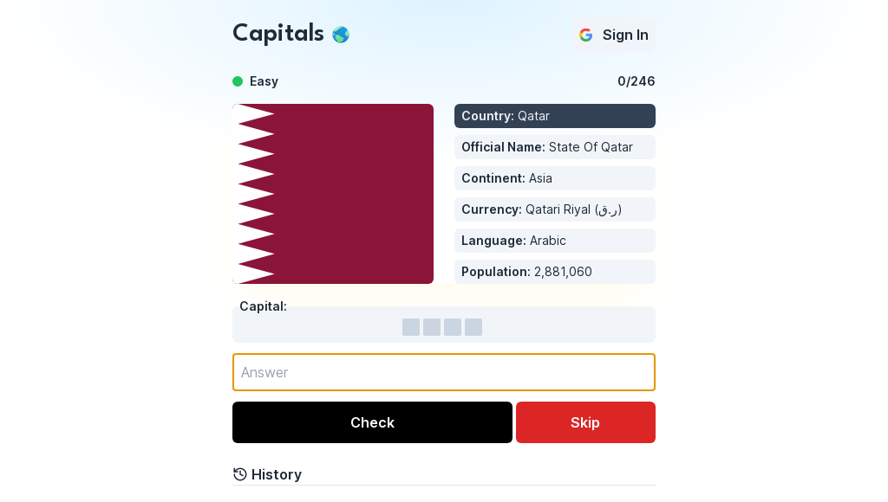

<br/>
<p align="center">
  <a href="https://github.com/FrancoCanzani/capitals-game">
    
  </a>

  <h3 align="center">Guess The Capital</h3>

  <p align="center">
    A Simple Game To Master Geography
    <br/>
    <br/>
    <a href="https://github.com/FrancoCanzani/capitals-game"><strong>Explore the docs »</strong></a>
    <br/>
    <br/>
    <a href="www.guessthecapital.com">Deployment</a>
    .
    <a href="https://github.com/FrancoCanzani/capitals-game/issues">Report Bug</a>
    .
    <a href="https://github.com/FrancoCanzani/capitals-game/issues">Request Feature</a>
  </p>
</p>

 

## Table Of Contents

- [About the Project](#about-the-project)
- [Built With](#built-with)
- [Getting Started](#getting-started)
  - [Prerequisites](#prerequisites)
- [Contributing](#contributing)
- [License](#license)

## About The Project



Capitals is a fun and interactive quiz where you can guess the capital of a random country. You can see detailed information about the country, such as its flag, official name, continent, currency, language, and population. You can also track your progress and see how you rank among other players on the leaderboard.

## Built With

Capitals was built using Next.js, a popular React framework for building web applications. It also uses Firebase for data storage and real-time synchronization for the leaderboard. The user interface was styled using Tailwind CSS, a utility-first CSS framework. The icons were provided by lucide-react, a library of simply beautiful icons for your web projects.

## Getting Started

To set up the project at `https://github.com/FrancoCanzani/capitals-game` locally, you can follow these steps:

1. Clone the repository to your local machine using Git:

```
git clone https://github.com/FrancoCanzani/capitals-game.git
```

2. Navigate to the project directory:

```
cd capitals-game
```

3. Install the necessary dependencies using npm:

```
npm install
```

4. Start the development server:

```
npm run dev
```

5. Open your web browser and navigate to `http://localhost:3000` to view the application.

You should now have a local copy of the Capitals Game project up and running on your machine.

### Prerequisites

Before setting up the project at `https://github.com/FrancoCanzani/capitals-game` locally, you need to make sure that you have the following prerequisites installed on your machine:

1. Node.js: Capitals Game was built using Next.js. Next.js requires Node.js to be installed on your machine. You can download and install Node.js from the official website at `https://nodejs.org/en/`.

2. Git: You need Git to clone the repository and manage version control. You can download and install Git from the official website at `https://git-scm.com/downloads`.

3. npm: Capitals Game uses npm to manage dependencies and packages. npm is included with Node.js, so you don't need to install it separately.

After you have installed these prerequisites, you can follow the steps I provided earlier to set up the project locally.

## Contributing

Thank you for your interest in contributing to the Capitals Game project at `https://github.com/FrancoCanzani/capitals-game`. Here are some guidelines to help you get started:

1. Fork the repository on GitHub.
2. Clone your forked repository to your local machine using Git:

```
git clone https://github.com/<your-username>/capitals-game.git
```

3. Navigate to the project directory:

```
cd capitals-game
```

4. Create a new branch for your changes:

```
git checkout -b my-new-feature
```

5. Make your changes to the codebase.
6. Test your changes locally by running the development server:

```
npm run dev
```

7. Commit your changes and push them to your forked repository:

```
git add .
git commit -m "Add my new feature"
git push origin my-new-feature
```

8. Create a pull request on GitHub to merge your changes into the main repository.

Please make sure that your changes are well-documented, well-tested, and follow the project's coding standards and guidelines.

Thank you for contributing to Capitals Game!

### Creating A Pull Request

1. Fork the Project
2. Create your Feature Branch (`git checkout -b feature/AmazingFeature`)
3. Commit your Changes (`git commit -m 'Add some AmazingFeature'`)
4. Push to the Branch (`git push origin feature/AmazingFeature`)
5. Open a Pull Request

## License

Distributed under the Apache-2.0 license. See [LICENSE](https://github.com/FrancoCanzani/capitals-game/blob/main/LICENSE.md) for more information.
